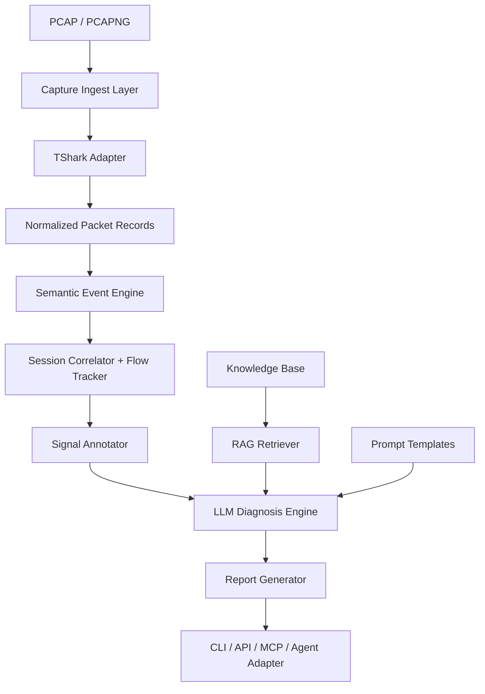
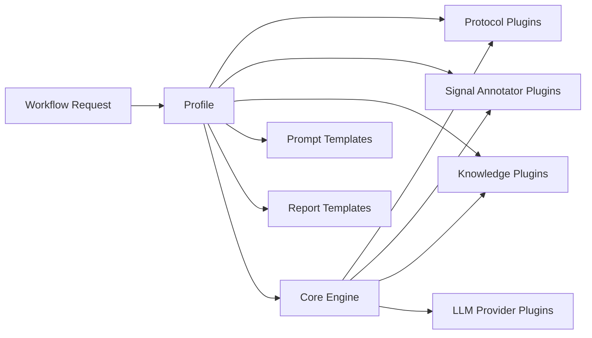

# 抓包分析工作流平台架构设计（目标架构）

> **注意**：本文档描述的是平台的**长期目标架构**，包含 Plugin/Profile/Agent 等完整能力。
> 实际开发中，前 3 个阶段使用简化架构（见 `intelligence-first-architecture.md`），
> 在阶段 4-5 逐步向本文档描述的目标架构演进。
> 简化架构之所以能平滑过渡，关键在于**数据合约（Pydantic 模型）从第一天起就与目标架构对齐**。
>
> **与 `intelligence-first-architecture.md` 的职责边界**：
> - `intelligence-first-architecture.md`：**当前实施指南**，描述阶段 1-3 的简化架构、数据模型、分层设计
> - `platform-architecture.md`（本文档）：**长期蓝图**，描述阶段 4+ 的 Plugin/Profile/Agent 完整能力
> - 开发时以 `intelligence-first-architecture.md` 为准，本文档作为演进方向参考

## 1. 文档目标

本文档定义一个面向多场景的抓包分析工作流平台架构。

平台目标不是只服务于 5GC，而是提供一套通用底座，使不同领域用户可以基于同一套引擎，按需装配：

- 协议定义
- 事件语义抽取
- 会话关联与流程跟踪
- 信号标注
- Prompt 模板
- RAG 知识库
- 模型接入方式
- Agent 工具接口

在产品落地上，平台第一阶段以 `5GC / Open5GS` 场景为切入点，先打穿高价值、高复杂度场景，再逐步扩展到 Web、音视频等领域。

---

## 2. 设计原则

### 2.1 平台化优先

核心引擎与具体场景解耦，领域能力通过 `profile` 装配。

### 2.2 Open5GS 优先，厂商实现可扩展

平台主干以标准协议流程和 `Open5GS` 参考实现为基线。
厂商或私有实现差异通过 `profile`、信号标注器、知识包扩展，而不是硬编码进平台主干。

### 2.3 智能优先，证据驱动

LLM 是**主诊断引擎**（而非仅做末端解释），但不直接处理原始抓包文本。

LLM 基于以下结构化输入进行推理和诊断：

- 结构化会话时间线
- 流程跟踪器状态
- 信号标注（客观事实标注，非诊断结论）
- 关键帧证据
- RAG 检索到的知识片段

**关键约束**：当关键链路依赖低置信度关联或抓包缺口时，系统必须允许输出
“受限诊断 / 非结论输出（`INCONCLUSIVE`）”，而不是伪确定性结论。

不同能力的模型获得不同程度的支撑：大模型自由推理，小模型通过 CoT prompt + RAG 增强。

### 2.4 插件化优先，过度 DSL 化谨慎

适合配置化的内容：

- 协议字段映射
- 事件模板
- 信号标注器装配
- Prompt 模板选择
- 知识库挂载
- Profile 组合

适合代码实现的内容：

- 协议重组核心逻辑
- 会话关联核心逻辑
- 流程跟踪器框架
- 诊断上下文压缩与 token 管理
- 模型调用与结构化输出校验

### 2.5 一期可用，二期 Agent 化增强

第一期目标是做出可用产品，而不是先做复杂 Agent 平台。
Agent 化、MCP 化、多轮工具调用等能力放在第二阶段增强。

> **注意**：前三阶段的简化架构详见 `intelligence-first-architecture.md`。
> 本文档描述的 Plugin/Profile/Agent 等完整能力属于阶段 4 及二期目标。

---

## 3. 核心概念

## 3.1 Plugin

`plugin` 是平台零件，用于扩展某一类能力。

典型插件类型包括：

- 协议插件
- 信号标注器插件
- 知识插件
- 模型 Provider 插件
- 输出插件

## 3.2 Profile

`profile` 是面向某个场景的分析方案包。

它通过组合插件和配置，定义一套可直接运行的分析工作流。

一个 `profile` 通常包含：

- 启用哪些协议
- 使用哪些事件模板
- 采用哪些会话关联键
- 加载哪些信号标注器
- 采用哪些 Prompt 模板
- 采用哪些知识库
- 使用何种报告输出模板

示例：

- `open5gs_5gc`
- `generic_web_http`
- `av_streaming`

## 3.3 Workflow

`workflow` 是具体的一次分析执行流程。

例如：

- 离线单次分析
- 按 UE 筛选分析
- 对指定 Session 失败原因进行深挖
- Agent 驱动的多轮分析

---

## 4. 总体架构图



---

## 5. 分层架构说明

### 5.1 接入层

#### 5.1 接入层模块

- `cli`
- `http api`
- `mcp adapter`
- `agent adapter`

#### 5.1 接入层职责

- 接收分析请求
- 加载指定 `profile`
- 下发运行参数
- 返回结构化分析结果或报告

#### 5.1 接入层输入

- `pcap/pcapng`
- profile 名称
- 过滤条件
- 模型配置
- 输出格式

#### 5.1 接入层输出

- JSON 结果
- Markdown 报告
- HTML 报告
- Agent 可消费的工具返回

---

### 5.2 Capture Ingest Layer

#### 5.2 Capture Ingest Layer 模块

- `file loader`
- `capture metadata reader`
- `packet source abstraction`

#### 5.2 Capture Ingest Layer 职责

- 管理输入文件
- 读取抓包基础信息
- 做运行前校验
- 支持单文件/多文件输入

#### 5.2 Capture Ingest Layer 边界

这一层不做协议语义理解，只做输入管理和元信息读取。

---

### 5.3 TShark Adapter

#### 5.3 TShark Adapter 模块

- `tshark executor`
- `field extractor`
- `display filter builder`
- `decode-as manager`
- `profile-aware extractor`

#### 5.3 TShark Adapter 职责

- 调用 `tshark`
- 根据 profile 选择字段
- 按协议定义导出结构化记录
- 支持按场景收敛抓取范围

#### 5.3 TShark Adapter 典型输出

- 帧号
- 时间戳
- 协议名
- 关键字段
- 会话键候选

#### 5.3 TShark Adapter 设计要点

- 协议字段清单由协议插件或协议配置描述
- 不直接把原始完整文本交给上层
- 支持可控的字段裁剪，减少后续推理噪声

---

### 5.4 协议定义层

#### 5.4 协议定义层模块

- `protocol registry`
- `protocol definition loader`
- `event template loader`

#### 5.4 协议定义层职责

定义某个协议如何被平台识别和抽象。

#### 5.4 协议定义层字段建议

- `name`
- `version`
- `display_filter`
- `fields`
- `correlation_keys`
- `message_patterns`
- `event_templates`

#### 5.4 协议定义层示例

`ngap` 协议定义可能声明：

- 关注 `InitialUEMessage`
- 关注 `DownlinkNASTransport`
- 关注 `UplinkNASTransport`
- 关联键使用 `RAN_UE_NGAP_ID`、`AMF_UE_NGAP_ID`

#### 5.4 协议定义层边界

协议定义层负责描述协议，不负责做完整故障判断。

---

### 5.5 语义事件引擎

#### 5.5 语义事件引擎模块

- `event builder`
- `event normalizer`
- `event validator`

#### 5.5 语义事件引擎职责

将原始字段记录抽象成统一语义事件。

#### 5.5 语义事件引擎字段建议

- `event_type`
- `protocol`
- `timestamp`
- `frame_number`
- `session_keys`
- `attributes`
- `raw_refs`

#### 5.5 语义事件引擎示例

- `REGISTRATION_REQUEST`
- `AUTHENTICATION_REQUEST`
- `REGISTRATION_REJECT`
- `PDU_SESSION_ESTABLISHMENT_REQUEST`
- `HTTP2_SBI_ERROR`
- `PFCP_SESSION_ESTABLISHMENT_FAILURE`

#### 5.5 语义事件引擎价值

这一层是平台最重要的通用资产，因为：

- 规则依赖它
- RAG 检索依赖它
- LLM 推理依赖它
- Agent 工具能力依赖它

---

### 5.6 会话关联层

#### 5.6 会话关联层模块

- `session correlator`
- `session assembler`
- `cross-protocol linker`

#### 5.6 会话关联层职责

将离散事件归并到可分析对象中。

#### 5.6 会话关联层分析对象

- `UE access session`
- `PDU session flow`
- `HTTP request flow`
- `RTP media flow`

#### 5.6 会话关联层关联键

- 5GC：`AMF-UE-NGAP-ID`、`RAN-UE-NGAP-ID`、`PDU Session ID`、`SEID`
- Web：`tcp stream`、`http2 stream id`
- 音视频：`ssrc`、`call-id`

#### 5.6 会话关联层设计要点

- 允许多协议联合关联
- 允许一个 session 下出现多个子流程
- 要能表达缺失、超时、乱序

---

### 5.7 流程跟踪器

> **设计理念变更**：原方案为重量级"诊断状态机"，已降级为轻量"流程跟踪器"。
> 跟踪器只负责记录流程进度和标记异常跳转，不做诊断判断。诊断由 LLM 完成。

#### 5.7 流程跟踪器模块

- `flow tracker runtime`
- `domain flow definitions`
- `timeout detector`

#### 5.7 流程跟踪器职责

对某个分析对象跟踪流程进度，输出：

- `current_step`：当前走到哪一步
- `completed_steps`：已完成的步骤
- `missing_steps`：预期但未出现的步骤
- `stuck_at`：如果超时，停在哪一步
- `anomalies`：异常跳转（跳过步骤、收到 Reject、重试）

#### 5.7 流程跟踪器设计建议

- 框架代码实现，各领域流程定义可配置化
- 流程推进基于语义事件，而不是原始包
- 支持并发子流程和超时检测
- 不做诊断判断，只输出结构化流程状态

#### 5.7 流程跟踪器示例

5GC 注册流程：

- `INITIAL_UE_MESSAGE`
- `REGISTRATION_REQUEST`
- `AUTHENTICATION_REQUEST`
- `AUTHENTICATION_RESPONSE`
- `SECURITY_MODE_COMMAND`
- `SECURITY_MODE_COMPLETE`
- `REGISTRATION_ACCEPT`

---

### 5.8 信号标注层

> **设计理念变更**：原方案为重量级"规则引擎"（50+ 条诊断规则），已降级为轻量"信号标注器"。
> 信号标注器只标注客观事实（错误码、超时、缺失步骤），不做诊断结论。诊断由 LLM 完成。

#### 5.8 信号标注层模块

- `signal annotator registry`
- `signal annotator runtime`
- `signal plugin loader`

#### 5.8 信号标注层职责

基于会话时间线和流程跟踪器状态，标注客观信号：

- Reject/Failure cause code
- 步骤间超时
- 预期步骤缺失
- SBI 错误码（HTTP 4xx/5xx）
- PFCP 失败 cause
- 重试行为
- 关联置信度低的环节

#### 5.8 信号标注层输出字段建议

- `signal_type`
- `severity`（info / warning / error）
- `frame_number`
- `description`（客观事实描述）
- `raw_value`（原始值）

#### 5.8 信号标注层分层建议

- `base annotators`（通用：超时、缺失步骤）
- `profile annotators`（领域相关：5GMM cause code）

#### 5.8 信号标注层设计原则

- 每个标注器 5-20 行代码，只标注客观事实
- 标注器之间互不干扰，无冲突消解需求
- 标注结果作为 LLM 诊断的辅助输入
- 具体标注器可作为插件按 profile 装配

---

### 5.9 诊断上下文构建层

#### 5.9 诊断上下文构建层模块

- `context assembler`
- `timeline formatter`
- `signal summarizer`
- `token budget manager`

#### 5.9 诊断上下文构建层职责

将会话时间线、信号标注、流程跟踪状态压缩成适合 LLM 消费的诊断上下文。

#### 5.9 诊断上下文构建层输出内容

- 格式化的会话时间线
- 信号标注摘要
- 流程跟踪状态
- 关键证据帧
- 需要 RAG 增强的检索 query

#### 5.9 诊断上下文构建层价值

这一层决定 LLM 是否能在有限 token 预算内高效推理。
对不同能力的模型需要不同的上下文压缩策略。

---

### 5.10 RAG 层

#### 5.10 RAG 层模块

- `document ingestor`
- `chunker`
- `embedding pipeline`
- `vector retriever`
- `reranker`

#### 5.10 RAG 层知识类型

- 标准知识
  - 3GPP cause 说明
  - 协议语义解释
- 实现知识
  - Open5GS 模块职责
  - 常见故障模式
- 经验知识
  - 排障手册
  - 典型案例

#### 5.10 RAG 层职责

- 提供知识增强上下文
- 将静态文档与动态证据联合检索
- 为不同 profile 提供隔离的知识空间

#### 5.10 RAG 层设计建议

- RAG 数据源按 profile 管理
- Prompt 中只注入命中的少量高质量片段

---

### 5.11 LLM 编排层

#### 5.11 LLM 编排层模块

- `provider registry`
- `prompt renderer`
- `structured output validator`
- `fallback strategy`

#### 5.11 LLM 编排层支持模式

- 本地模型
- `Ollama`
- OpenAI 兼容 API
- 其他自定义 API

#### 5.11 LLM 诊断引擎职责

- 接收结构化会话数据 + 信号标注，执行**主诊断推理**
- 根据模型能力选择 prompt 策略（大模型自由推理 / 小模型 CoT + RAG）
- 调用模型生成结构化诊断结论
- 对结果做 Pydantic schema 校验，失败时自动重试或降级

#### 5.11 LLM 诊断引擎设计要点

- **LLM 是主诊断引擎**，不仅是解释器
- 推理模型与 embedding 模型解耦
- 输出结构化 JSON（DiagnosisResult）
- 分层智能：大模型自由推理，中模型引导推理，小模型模板化推理 + RAG
- 当证据不足或关联歧义较高时，优先输出 `limitations` 和 `INCONCLUSIVE`，而不是强推断根因
- 必须保留非 `LLM` 兜底路径：至少能稳定输出时间线、信号标注、流程状态和待人工确认项

---

### 5.12 报告与输出层

#### 5.12 报告与输出层模块

- `json reporter`
- `markdown reporter`
- `html reporter`
- `agent tool formatter`

#### 5.12 报告与输出层职责

- 面向人输出报告
- 面向工具输出结构化结果
- 支持不同 profile 的报告模板

#### 5.12 报告与输出层结构建议

- 问题摘要
- 证据链
- 时间线
- 信号标注
- LLM 诊断结论
- 排查建议
- 待人工确认项
- 诊断限制项（抓包不完整、关联歧义、模型上下文裁剪）

---

## 6. Plugin 与 Profile 关系图



### 6. Plugin 与 Profile 关系解释

- `Core Engine` 提供运行框架
- `Plugin` 提供能力零件
- `Profile` 负责按场景进行装配
- `Workflow Request` 负责选择本次执行的 profile 和参数

---

## 7. 推荐目录结构

```text
traceweaver/
  ingest/
  tshark/
  events/
  correlate/
  flow_tracker/
  signals/
  diagnosis/
  rag/
  llm/
  reports/
  models/           # Pydantic 数据合约
  profile/
  plugin/
  api/
  cli/
profiles/
  open5gs_5gc/
    protocols/
    signals/
    prompts/
    knowledge/
    templates/
    profile.yaml
  generic_web_http/
    ...
  av_streaming/
    ...
tests/
  fixtures/pcap/
docs/
```

---

## 8. 关键接口设计建议

## 8.1 平台统一分析接口

```text
analyze_capture(input, profile, options) -> AnalysisResult
```

### 8.1 平台统一分析接口输入

- 抓包文件路径
- profile 名称
- 可选过滤条件
- 模型配置
- 输出格式

### 8.1 平台统一分析接口输出

- session 列表
- signals（信号标注）
- diagnosis（LLM 诊断结论）
- report
- evidence

## 8.2 Agent 可调用工具接口

建议最少提供以下工具：

- `analyze_capture`
- `list_sessions`
- `get_session_timeline`
- `get_frame_detail`
- `get_signals`
- `retrieve_knowledge`
- `generate_report`

---

## 9. 第一阶段推荐官方 Profile

## 9.1 `open5gs_5gc`

### 9.1 `open5gs_5gc` 目标场景

- UE 接入失败
- PDU Session 建立失败

### 9.1 `open5gs_5gc` 启用协议

- `NGAP`
- `NAS-5GS`
- `HTTP2 SBI`
- `PFCP`

### 9.1 `open5gs_5gc` 加载能力

- 5GC 事件模板
- 5GC 流程定义
- 5GC 信号标注器
- Open5GS 知识包
- 5GC Prompt 模板（大/中/小模型分层）
- 5GC 报告模板

### 9.1 `open5gs_5gc` 设计价值

- 复杂度高，能逼出平台底座能力
- 与当前经验强相关，最容易快速形成高质量产出
- 开源传播时可以以 Open5GS 兼容作为主叙事

---

## 10. 非功能要求

## 10.1 可扩展性

- 新协议接入不应要求大改核心引擎
- 新信号标注器应可独立注册
- 新 profile 应可独立装配

## 10.2 可解释性

- 每条结论要能追溯到信号标注、事件、帧号
- LLM 诊断输出要可引用底层证据

## 10.3 离线可运行

- 支持本地模型
- 支持 Ollama
- 支持无外网部署

## 10.4 安全与稳定性

- 严格限制单次注入给模型的上下文大小
- 大文件分析需支持分阶段处理
- 对模型输出进行 schema 校验，防止下游崩溃

---

## 11. 不建议第一期就做的事情

- 不要先做过重的前端平台
- 不要先做过度通用的 DSL
- 不要先支持过多领域 profile
- 不要先把 Agent 设计成系统核心
- 不要跳过结构化数据工程直接让 LLM 分析原始 tshark 输出

---

## 12. 架构结论

该平台的正确形态是：

- 以**结构化数据工程**（tshark 抽取 → 事件识别 → 会话组装）作为不可省略的底座
- 以 **LLM** 作为主诊断引擎，**信号标注器**提供客观事实辅助
- 以 `Plugin` 作为扩展零件，以 `Profile` 作为场景装配层
- 以 `5GC / Open5GS` 作为第一落地场景
- 以 `Agent + RAG` 作为第二阶段增强能力

这样既能满足当前 5GC 场景价值，又能为后续 Web、音视频等领域扩展保留清晰边界。
